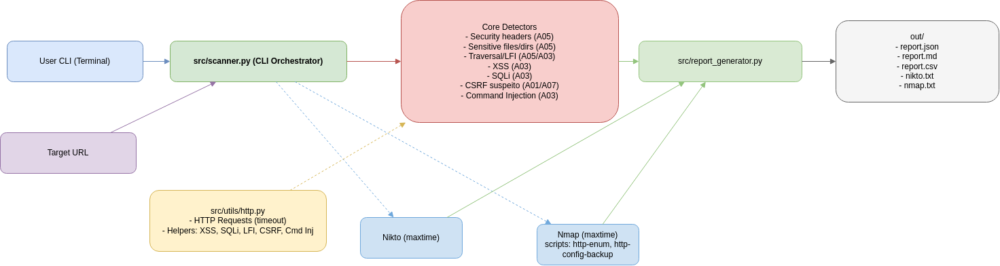
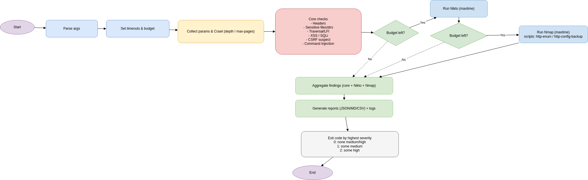

# PF Techacker – Web Security Scanner

Ferramenta de avaliação de segurança para aplicações web. O foco principal é automação via CLI, integração opcional com scanners externos e geração automática de relatórios em JSON, CSV e Markdown.

## O que a ferramenta faz

1) **Varre uma URL** e executa checagens “core” (nativas em Python):
  - **Security headers ausentes** (A05)  
  `Strict-Transport-Security, Content-Security-Policy, X-Frame-Options, X-Content-Type-Options, Referrer-Policy, Permissions-Policy`
  - **Arquivos/diretórios sensíveis** (A01/A05)  
    Exemplos: `/.git/HEAD`, `/.env`, `/config.php`, `/backup.zip`, `/admin/`
  - **Directory Traversal / LFI** (A01, possivelmente A05)  
    Variações de `../../etc/passwd` + URL-encode.
  - **XSS refletido** (A03)  
    Payloads como `<script>alert(1)</script>`, `onerror=`, `svg onload`, etc.
  - **SQL Injection (possível)** (A03)  
    Payloads boolean/time-based multi-SGBD + heurística de erro/HTTP 500.
  - **CSRF suspeito** (A01 — e em alguns casos relacionado a A07)  
    Formulários `POST` sem token característico.
  - **Command Injection (possível)** (A03)  
    Payloads de conteúdo (`;id`) e time-based (atraso consistente).

2) **Integra ferramentas open source**:
  - **Nikto** (checagens HTTP do servidor).
  - **Nmap** (enumeração web via scripts NSE básicos).

3) **Gera relatórios** com:
  - Severidade (`high/medium/low`),
  - **OWASP code** (A01–A10)  ,
  - **Mitigação sugerida** específica por tipo de achado.

4) **Progresso visual** no terminal (barra de progresso + relógio).

## Estrutura do projeto

```
.github/workflows
└── security_scan.yml
/src
  ├── scanner.py               # CLI principal (checks + integrações)
  ├── report_generator.py      # gera JSON/CSV/Markdown
  ├── utils/
  │   └── http.py              # helpers HTTP e detectores
  └── tests/
      └── test_detectors.py    # testes unitários mínimos
/out                           # outputs de vulnerabilidades encontradas
  ├── report.csv             
  ├── report.json     
  └── report.md

/docs                          # diagrama de arquitetura e fluxograma
  ├── architecture_diagram.png
  └── flowchart.png
README.md
requirements.txt
```

## Arquitetura

O `scanner.py`:
1. coleta parâmetros e faz **crawl leve** (controlável),  
2. executa os **detectores core**,  
3. roda **Nikto** e **Nmap** com **maxtime** por ferramenta e **budget global**,  
4. agrega achados e chama `report_generator.py` para escrever os relatórios.

## Resultados e relatórios

Arquivos gerados no diretório escolhido em --out:
	•	report.json – estrutura completa para integrações e pipelines.
	•	report.csv – planilhável para priorização rápida.
	•	report.md – leitura humana, com sumário por severidade e lista detalhada.
	•	nikto.txt / nmap.txt – logs brutos das integrações (quando executadas).

Cada arquivo contém os campos principais: `time`, `type`, `severity`, `url`, `param`, `evidence`, `owasp`, `tool`, `solution`.

## Cobertura (mapeamento OWASP)

- **A03 – Injection:** SQLi, XSS refletido, Command Injection
- **A01 – Broken Access Control (principal) / A05 – Security Misconfiguration (possível):** Directory Traversal / LFI
- **A05 – Security Misconfiguration:** Headers de segurança ausentes, exposição de arquivos/diretórios sensíveis
- **A01 (e às vezes relacionado a A07):** CSRF (suspeita) em formulários sem token

### OWASP Top 10 (2021) — quick reference
| Code | Name                               |
|------|------------------------------------|
| A01  | Broken Access Control              |
| A02  | Cryptographic Failures             |
| A03  | Injection                          |
| A04  | Insecure Design                    |
| A05  | Security Misconfiguration          |
| A06  | Vulnerable and Outdated Components |
| A07  | Identification and Auth Failures   |
| A08  | Software and Data Integrity Fail.  |
| A09  | Security Logging and Monitoring    |
| A10  | Server-Side Request Forgery (SSRF) |

---

## Instalação

### Requisitos

- Python 3.10+
- `pip` / `venv`
- Dependências listadas em `requirements.txt` (instale com pip)
- (Opcional) Ferramentas externas para integrações:
  - Nikto e Nmap (Linux: `sudo apt install nikto nmap`)

### Passos da Instalação

1. Crie e ative um ambiente virtual

```bash
python -m venv .venv
source .venv/bin/activate
```

2. Instale dependências

```bash
pip install -r requirements.txt
```

### Como rodar (principais opções)

Uso mínimo (verificações internas):

```bash
python -m src.scanner -t http://testphp.vulnweb.com
```

Exibir JSON no stdout (útil para CI/avaliação automática):

```bash
python -m src.scanner -t http://testphp.vulnweb.com --json-stdout
```

Executar com ferramentas auxiliares (nikto + nmap):

```bash
python -m src.scanner -t http://testphp.vulnweb.com --nikto --nmap --json-stdout
```

## Exemplo real usado no desenvolvimento (Juice Shop demo):

```bash
python -m src.scanner -t https://demo.owasp-juice.shop --nikto --nmap --json-stdout
```
## Exemplo de comando com ajustes de tempo completo

```bash
python -m src.scanner \
  -t https://demo.owasp-juice.shop \
  --crawl-depth 1 \
  --nikto \
  --nmap \
  --fancy-progress \
  --max-scan-seconds 0 \
  --nikto-maxtime 0 \
  --nmap-maxtime 0 \
  --request-timeout 8 \
  --out out-fulltime
```

Opções úteis:

- `-t/--target` : URL alvo (obrigatório)
- `--json-stdout` : imprime JSON no stdout além de salvar arquivos
- `--nikto` / `--nmap` : ativa integrações externas
- `--crawl-depth N` : profundidade de crawling (padrão baixo)
- `--nikto-maxtime SECS` : tempo máximo para o Nikto (segundos)
- `--max-scan-seconds SECS` : tempo máximo para integrações externas/scan em geral
- `--request-timeout SECS` : timeout de cada request HTTP (padrão: 8s no exemplo)
- `--out PATH` : diretório de saída para relatórios (padrão: `out`)
- `--fancy-progress` : usa barras/belicos do rich para progresso


Observação importante sobre timeouts e cobertura de detecção

  O scanner tem vários temporizadores configuráveis. Ajustar esses valores altera a quantidade e a qualidade dos achados:

  - Timeout/request curto (ex.: `--request-timeout 2`) torna as requisições mais rápidas, mas aumenta falsos-negativos — a ferramenta poderá não detectar vulnerabilidades que exigem respostas lentas ou tentativas adicionais.
  - Timeout/request maior (ex.: `--request-timeout 10` e `--max-scan-seconds 300`) aumenta a cobertura e a chance de detectar vulnerabilidades, mas também aumenta o tempo total da execução.

  Em resumo: quanto menor o tempo, mais rápido o scan e menor a cobertura; quanto maior o tempo, mais completo (mas mais lento).


### Exemplo de resultado (lista de vulnerabilidades) - Caso teste

Ao rodar a ferramenta contra `https://demo.owasp-juice.shop` com:

```bash
python -m src.scanner \
  -t https://demo.owasp-juice.shop \
  --crawl-depth 1 \
  --nikto --nmap \
  --max-scan-seconds 100 \
  --request-timeout 8
```

Obtivemos uma lista de vulnerabilidades encontradas, incluindo, por exemplo, a vulnerabilidade abaixo de Security Misconfiguration (A05) relacionadas a cabeçalhos de segurança ausentes:

```bash
{
    "time": "2025-11-17T17:34:28.357185Z",
    "type": "Security Headers ausentes",
    "severity": "medium",
    "url": "https://demo.owasp-juice.shop",
    "param": "",
    "evidence": "strict-transport-security, content-security-policy, referrer-policy, permissions-policy",
    "owasp": "A05",
    "owasp_desc": "Security Misconfiguration: insecure default configs, open buckets, missing headers, verbose errors.",
    "tool": "core",
    "solution": "Enable HSTS (e.g., max-age>=15552000; includeSubDomains; preload). Force HTTPS at the edge/load balancer and remove HTTP endpoints.; Define a restrictive CSP (e.g., default-src 'self'; object-src 'none'; base-uri 'self'; frame-ancestors 'none'). Avoid inline scripts or use nonces/hashes; audit third-party domains.; Adopt a strict Referrer-Policy (e.g., no-referrer or strict-origin-when-cross-origin) to minimize data leakage.; Use Permissions-Policy to disable unused browser features (e.g., geolocation=(), camera=(), microphone=())."
  }
```

## Perfis de execução (tempo limitado x completo)

* Tempo limitado (3 min – demonstração)
	•	--max-scan-seconds 180 (orçamento total).
	•	Fatias por integração: --nikto-maxtime e --nmap-maxtime.
	•	Request timeout: controla cada requisição do core.

* Tempo ilimitado (exploração mais profunda)
	•	--max-scan-seconds 0 (sem corte global).
	•	Requests e integrações continuam limitados por seus próprios timeouts.

* Dicas de performance
	•	Reduza --crawl-depth e --max-pages para priorizar integrações.
	•	Use --params para focar em poucos parâmetros (ex.: --params q id email).
	•	Ajuste --request-timeout conforme a latência do alvo.


* Integrações (Nikto & Nmap)
	•	Nikto
	•	Executado com -maxtime e leitura streaming para manter o relógio fluido.
	•	Log salvo em nikto.txt; achados relevantes agregados ao relatório (metadados filtrados).
	•	Nmap
	•	Comando: -Pn -p 80,443 --script http-enum,http-config-backup.
	•	Tempo controlado externamente; log salvo em nmap.txt e achados agregados.

Se o orçamento acabar antes, uma integração pode ser pulada — os relatórios deixam claro o que foi executado.

---

## Metodologia de testes

Para validar a ferramenta, adotamos a seguinte metodologia:

- **Alvos de teste**
  - `http://testphp.vulnweb.com` – aplicação vulnerável clássica (SQLi, XSS).
  - `https://demo.owasp-juice.shop` – aplicação propositalmente insegura do OWASP.
- **Cenários de execução**
  - Scan rápido, apenas com verificações internas:  
    `python -m src.scanner -t <alvo> --crawl-depth 0`
  - Scan completo com integrações externas:  
    `python -m src.scanner -t <alvo> --nikto --nmap --crawl-depth 1 --max-scan-seconds 300`
- **Configurações variáveis**
  - `--crawl-depth` para aumentar/diminuir o número de URLs/parametros explorados.
  - `--request-timeout` e `--max-scan-seconds` para balancear tempo de execução vs. cobertura.
- **Validação**
  - Execução dos testes unitários em `src/tests/test_detectors.py` para garantir que os detectores básicos (XSS/SQLi/etc.) continuam funcionando após mudanças no código.

## Sugestões de mitigação 

Cada vulnerabilidade reportada traz um campo `solution` com recomendações específicas. Alguns exemplos:

- **Security Misconfiguration (A05)**  
  - Habilitar HSTS (`Strict-Transport-Security`) e forçar HTTPS.
  - Definir uma Content-Security-Policy restritiva, evitando scripts inline.
  - Ajustar `Referrer-Policy` para minimizar vazamento de dados.
  - Usar `Permissions-Policy` para desabilitar recursos do navegador não utilizados.

- **Injection (A03 – SQLi / Command Injection)**  
  - Usar queries parametrizadas / ORM seguro.
  - Validar e sanitizar entradas do usuário.
  - Evitar interpolar entradas diretamente em comandos de sistema.

- **XSS (A03)**  
  - Escapar corretamente dados refletidos em HTML/JS.
  - Utilizar CSP para limitar fontes de script.
  - Validar e sanitizar campos de entrada/texto rico.

- **CSRF**  
  - Incluir tokens anti-CSRF em formulários sensíveis.
  - Verificar origem/referer das requisições.

---

# Diagrama 



# Fluxograma



# Link para vídeo

[link](https://youtu.be/filN3SmG7WY)
